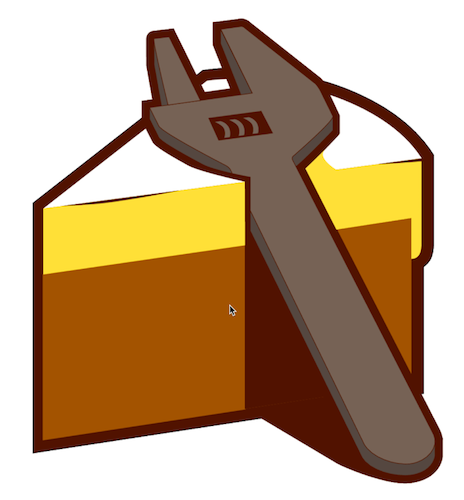
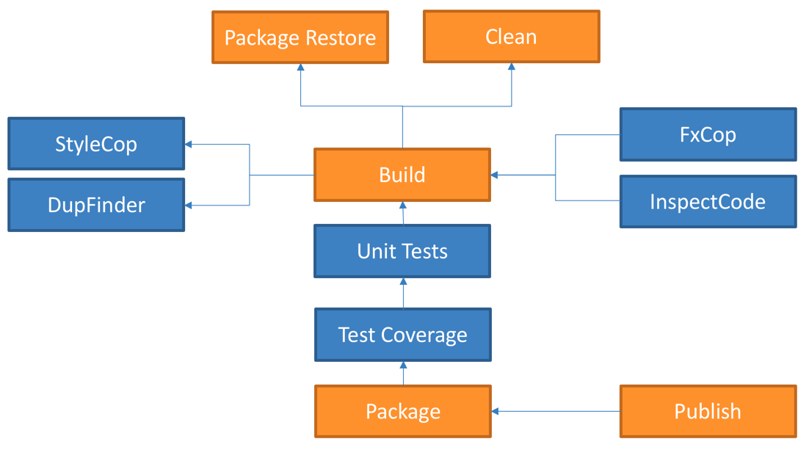

@title[A Piece of Cake]

## A Piece of Cake
### C# powered cross platform build automationß

---

@title[What is a Build?]
## What is a Build?

+++

@title[Build Step]
Typical Build Workflow

<!-- .slide: data-background-transition="none" -->

+++

@title[Package Restore Step]
Typical Build Workflow

<!-- .slide: data-background-transition="none" -->

+++

@title[Unit Test Step]
Typical Build Workflow

<!-- .slide: data-background-transition="none" -->

+++

@title[Clean Step]
Typical Build Workflow

<!-- .slide: data-background-transition="none" -->

+++

@title[Test Coverage Step]
Typical Build Workflow

<!-- .slide: data-background-transition="none" -->

+++

@title[Code Inspection Step]
Typical Build Workflow

<!-- .slide: data-background-transition="none" -->

+++

@title[Package Step]
Typical Build Workflow

<!-- .slide: data-background-transition="none" -->

+++

@title[Publish Step]
Typical Build Workflow

<!-- .slide: data-background-transition="none" -->

---

## What is Cake?

+++

@title[Cake Logo]

+++

@title[A Definition...]
### A Definition...

"Cake (C# Make) is a cross platform build automation system with a C# DSL to do things like compiling code, copy files/folders, running unit tests, compress files and build NuGet packages.”

---

@title[How does Cake work?]
## How does Cake work?

+++

@title[Start with Cake.exe/dll]

+++

@title[Available from lots of places]
<!-- .slide: data-background-transition="none" -->

+++

@title[Add Configuration]
<!-- .slide: data-background-transition="none" -->

+++

@title[Pass your build script]
<!-- .slide: data-background-transition="none" -->

+++

@title[Add pre-processor directives]
<!-- .slide: data-background-transition="none" -->

+++

@title[Compile with Roslyn]
<!-- .slide: data-background-transition="none" -->

+++

@title[Script will be executed]
<!-- .slide: data-background-transition="none" -->

+++

@title[Tada!]
<!-- .slide: data-background-transition="none" -->

---

@title[What tools am I able to use with Cake?]
## What tools am I able to use with Cake?

+++

@title[Lots of tools!]

---

@title[Okay, but why do I need it?]
## Okay, but why do I need it?

---

@title[We build Cake with Cake on...]
## We build Cake with Cake on...

---

@title[Can't I just use...]
## Can't I just use...

- FAKE
- MAKE |
- CMake |
- MSBuild |
- NAnt |
- PSake |
- Bau |
- ? |

---

@title[Source Code]
## Source Code
### http://gep13.me/CakeDemos

---

@title[Let's bake some Cake]
## Let's bake some Cake

---

@title[Demos]
## Demos

---

@title[Questions]
## Questions?

Feel free to get in touch

Email: gep13@gep13.co.uk

Twitter: @gep13

Web: http://www.gep13.co.uk

---

@title[Resources]
## Resources

* Cake Documentation - https://cakebuild.net/docs/
* Source Code - https://github.com/cake-build/cake
* Presentations - https://cakebuild.net/docs/resources/presentations
* Podcasts - https://cakebuild.net/docs/resources/podcasts
* Videos - https://cakebuild.net/docs/resources/videos
* Blog Posts - https://cakebuild.net/docs/resources/blogs