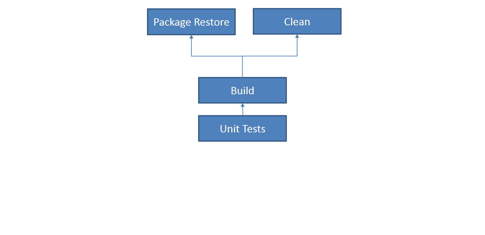
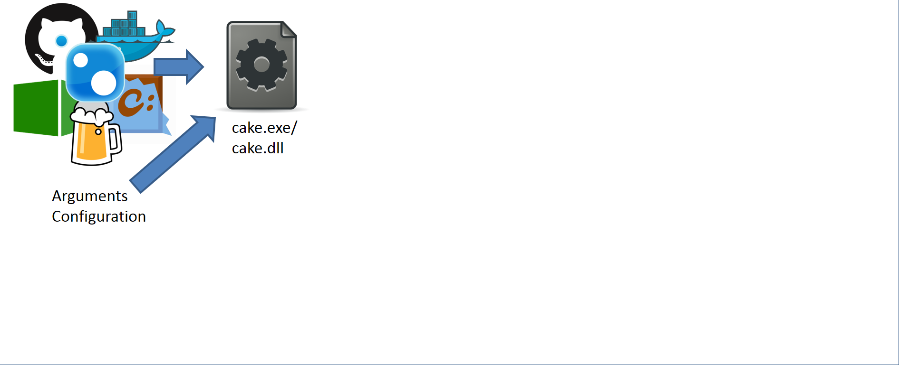
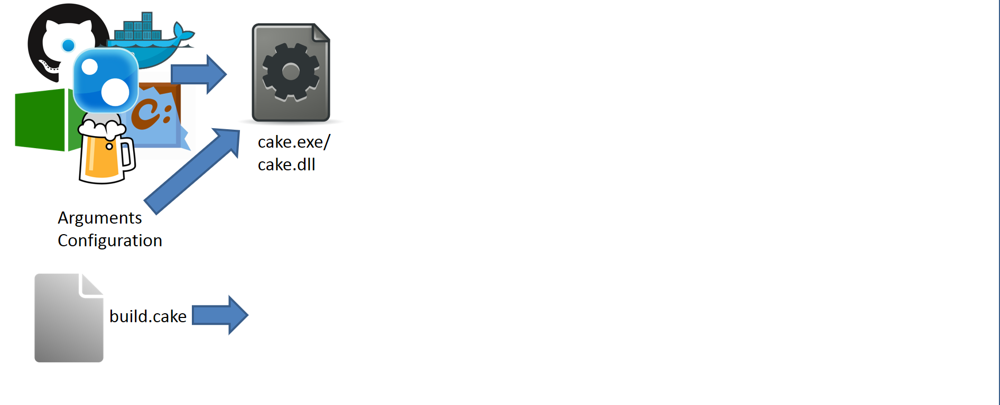
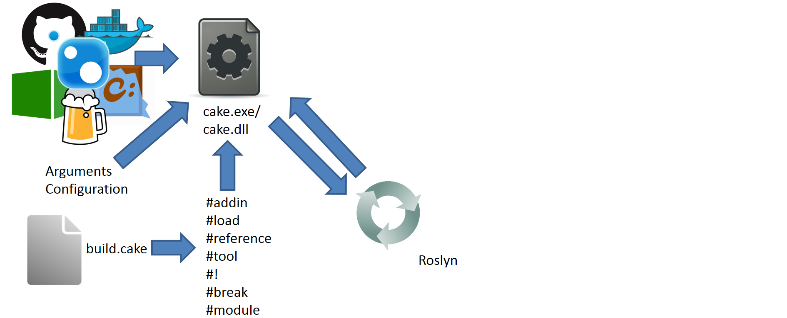
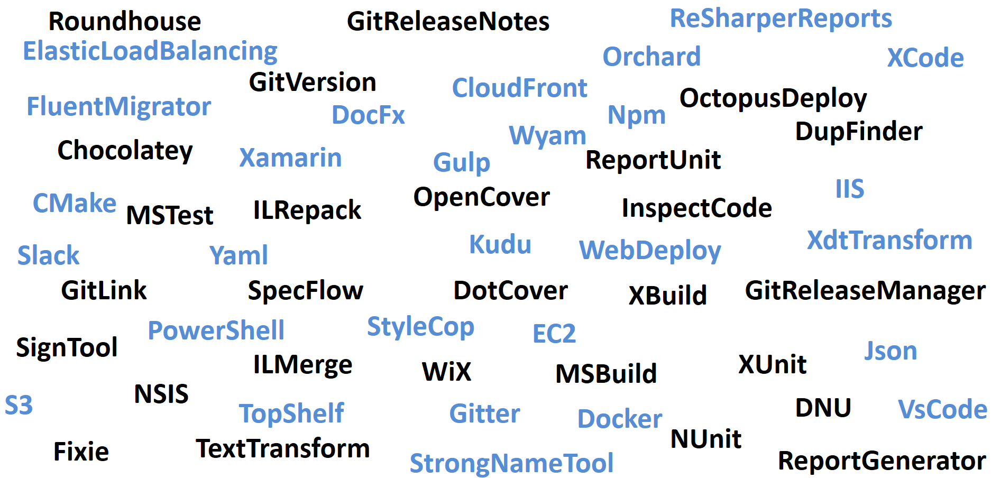
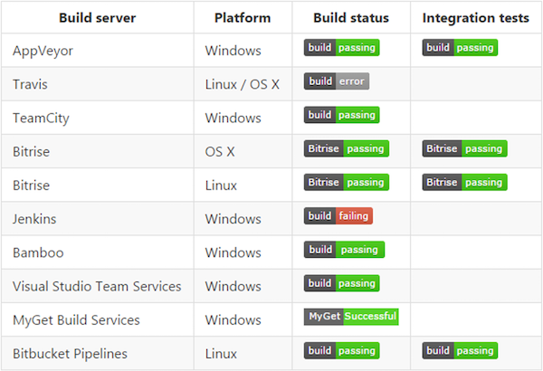

## A Piece of Cake
### C# powered cross platform build automationß

+++

Gary Ewan Park

Email: gep13@gep13.co.uk

Twitter: @gep13

Web: http://www.gep13.co.uk

---

## What is a build?

+++

Typical Build Workflow

+++

Typical Build Workflow

+++

Typical Build Workflow

+++

Typical Build Workflow

+++

Typical Build Workflow

+++

Typical Build Workflow

+++

Typical Build Workflow

+++

Typical Build Workflow

---

## What is Cake?

---

## How does Cake work?

+++

+++

+++

+++

+++

+++

+++

+++

---

## What tools am I able to use with Cake?

+++

---

## Okay, but why do I need it?

---

## We build Cake with Cake on...

---

## Source Code

---

## Demos

---

## Questions?

Feel free to get in touch

Email: gep13@gep13.co.uk

Twitter: @gep13

Web: http://www.gep13.co.uk

---

## Resources

* Cake Documentation
  * https://cakebuild.net/docs/
* Source Code
  * https://github.com/cake-build/cake
* Presentations
  * https://cakebuild.net/docs/resources/presentations
* Podcasts
  * https://cakebuild.net/docs/resources/podcasts
* Videos
  * https://cakebuild.net/docs/resources/videos
* Blog Posts
  * https://cakebuild.net/docs/resources/blogs