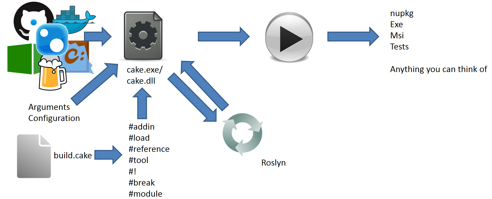

@title[A Piece of Cake]

@snap[midpoint h3-blue span-100]
# A Piece of Cake
### C# powered cross platform build automation
@snapend

---
@title[Slides and Code]

## Slides

#### https://gep13.me/CakeSlides

@fa[plus-square fa-2x fa-pad-icon text-gold]

## Code

#### https://gep13.me/CakeDemos

---?color=linear-gradient(90deg, black 25%, white 25%)
@title[What is a build?]

@snap[west h1-white]
# Q
@snapend

@snap[east span-65]
#### What is a
## @css[text-gold text-bold](Build )@fa[question]
@snapend

Note:
Cake creates a Directed acyclic graph of each of the tasks.

Makes sure that each task is only run once.

+++?color=linear-gradient(90deg, #5289F7 25%, white 25%)
@title[Typical Build Workflow]

@snap[north-east text-05 text-gray]
Q. What is a Build?
@snapend

@snap[west h1-white]
# A
@snapend

@snap[east span-70]
## Typical Build Workflow
@snapend

+++

@title[Build Step]
@snap[north-east text-05 text-gray]
Q. What is a Build?
@snapend

Typical Build Workflow

+++

@title[Package Restore Step]
@snap[north-east text-05 text-gray]
Q. What is a Build?
@snapend

Typical Build Workflow

<!-- .slide: data-transition="none" -->

+++

@title[Unit Test Step]
@snap[north-east text-05 text-gray]
Q. What is a Build?
@snapend

Typical Build Workflow

<!-- .slide: data-transition="none" -->

+++

@title[Clean Step]
@snap[north-east text-05 text-gray]
Q. What is a Build?
@snapend

Typical Build Workflow

<!-- .slide: data-transition="none" -->

+++

@title[Test Coverage Step]
@snap[north-east text-05 text-gray]
Q. What is a Build?
@snapend

Typical Build Workflow

<!-- .slide: data-transition="none" -->

+++

@title[Code Inspection Step]
@snap[north-east text-05 text-gray]
Q. What is a Build?
@snapend

Typical Build Workflow

<!-- .slide: data-transition="none" -->

+++

@title[Package Step]
@snap[north-east text-05 text-gray]
Q. What is a Build?
@snapend

Typical Build Workflow

<!-- .slide: data-transition="none" -->

+++

@title[Publish Step]
@snap[north-east text-05 text-gray]
Q. What is a Build?
@snapend

Typical Build Workflow

<!-- .slide: data-transition="none" -->

---?color=linear-gradient(90deg, black 25%, white 25%)
@title[What is Cake?]

@snap[west h1-white]
# Q
@snapend

@snap[east span-65]
#### What is
## @css[text-gold text-bold](Cake )@fa[question]
@snapend

+++

@title[Not this Cake]
@snap[north-east text-05 text-gray]
Q. What is Cake?
@snapend

+++

@title[Cake]
@snap[north-east text-05 text-gray]
Q. What is Cake?
@snapend

Note:
Full disclosure, I am one of seven maintainers of the Cake project on GitHub.

Some history/information:
- Open Source
- Supports the most common tools out of the box
- Cross Platform (Windows OS X Linux)
- Small but slowly growing
  - almost 1100 Pull Requests
  - 172 Contributors
  - 275 third party addins
  - over 2200 Stars
  - Over 3.8 million downloads

+++?color=linear-gradient(90deg, #5289F7 25%, white 25%)
@title[Cake]

@snap[north-east text-05 text-gray]
Q. What is Cake?
@snapend

@snap[west h1-white]
# A
@snapend

@snap[east span-70]
@quote[Cake, C# Make, is a cross platform build automation system with a C# DSL to do things like compiling code, copy files/folders, running unit tests, compress files and build NuGet packages.](Cake Website)
@snapend

Note:
Built using Roslyn, allowing execution on both Windows, OS X and Linux.

Script Processing to make sure things work the same on both.

---?color=linear-gradient(90deg, black 25%, white 25%)
@title[How does Cake work?]

@snap[west h1-white]
# Q
@snapend

@snap[east span-65]
#### How does Cake
## @css[text-gold text-bold](work )@fa[question]
@snapend

+++?color=linear-gradient(90deg, #5289F7 25%, white 25%)
@title[It's not magic!]

@snap[north-east text-05 text-gray]
Q. How does Cake work?
@snapend

@snap[west h1-white]
# A
@snapend

@snap[midpoint span-70]
## It's not

@snapend

+++

@title[Start with Cake.exe/dll]
@snap[north-east text-05 text-gray]
Q. How does Cake work?
@snapend

+++

@title[Available from lots of places]
@snap[north-east text-05 text-gray]
Q. How does Cake work?
@snapend

<!-- .slide: data-transition="none" -->

+++

@title[Add Configuration]
@snap[north-east text-05 text-gray]
Q. How does Cake work?
@snapend

<!-- .slide: data-transition="none" -->

+++

@title[Pass your build script]
@snap[north-east text-05 text-gray]
Q. How does Cake work?
@snapend

<!-- .slide: data-transition="none" -->

+++

@title[Add pre-processor directives]
@snap[north-east text-05 text-gray]
Q. How does Cake work?
@snapend

<!-- .slide: data-transition="none" -->

+++

@title[Compile with Roslyn]
@snap[north-east text-05 text-gray]
Q. How does Cake work?
@snapend

<!-- .slide: data-transition="none" -->

+++

@title[Script will be executed]
@snap[north-east text-05 text-gray]
Q. How does Cake work?
@snapend

<!-- .slide: data-transition="none" -->

+++

@title[Tada!]
@snap[north-east text-05 text-gray]
Q. How does Cake work?
@snapend

<!-- .slide: data-transition="none" -->

---?color=linear-gradient(90deg, black 25%, white 25%)
@title[What tools can I use with Cake?]

@snap[west h1-white]
# Q
@snapend

@snap[east span-65]
#### What tools can I use with
## @css[text-gold text-bold](Cake )@fa[question]
@snapend

+++?color=linear-gradient(90deg, #5289F7 25%, white 25%)

@title[Lots of tools!]
@snap[north-east text-05 text-gray]
Q. What tools can I use with Cake?
@snapend

@snap[west h1-white]
# A
@snapend

@snap[east span-70]

@snapend

Note:
Black ones are built in and ship with Cake.

Blue ones are those that have been created by the community.

There are aliases that span across:
  * Unit Testing Frameworks
  * Test Coverage
  * Static Code Analysis
  * JavaScript Runners
  * Documentation Generators
  * Chat Systems
  * Publishing

---?color=linear-gradient(90deg, black 25%, white 25%)
@title[Okay, but why do I need it?]

@snap[west h1-white]
# Q
@snapend

@snap[east span-65]
#### Okay, but why do I
## @css[text-gold text-bold](need it )@fa[question]
@snapend

+++?color=linear-gradient(90deg, #5289F7 25%, white 25%)

@title[Lots of tools!]
@snap[north-east text-05 text-gray]
Q. Okay, but why do I need it?
@snapend

@snap[west h1-white]
# A
@snapend

@snap[east span-70]

@snapend

Note:
Talk about compiling directly out of Visual Studio:
  - You might run some Unit Tests after the build has completed
  - You might run some static analysis tools within Visual Studio
  - You might manually create and deploy a package once you know that everything works

This is prone to human error, and not repeatable or maintainable as the complication of the application increases

+++

@title[We build Cake with Cake on...]
## We build Cake with Cake on...

Note:
8 Different CI Services.

3 Different Operating Systems.

---

<!-- .slide: data-transition="none" -->
@title[Alternative Build Tools]
## Can't I just use...

@ul[text-08]
- FAKE
- MAKE
- CMake
- MSBuild
- NAnt
- PSake
- Nuke
- ?
@ulend

Note:
You can use any of these that you want.

Fully agree with the concept of a polyglot developer, but from a strictly pragmatic point of view, writing a build script in the same language as you are developing, makes a lot of sense.

---

@title[Let's bake some Cake]
## Let's bake some Cake

---
@title[Slides and Code]

## Slides

#### https://gep13.me/CakeSlides

@fa[plus-square fa-2x fa-pad-icon text-gold]

## Code

#### https://gep13.me/CakeDemos

---?color=beige

@title[Demos]
## Demos

---?color=#7FDBFF
@title[Who Am I? - Gary Ewan Park]

@snap[north-west]
Who am I?
@snapend

@snap[west span-65]
Senior Software Engineer @ Chocolatey Software
 
 

@snapend

@snap[east span-30]

 

Gary Ewan Park

@snapend

@snap[south-west bio-contact]
@fa[twitter twitter-blue]&nbsp;&nbsp;gep13&nbsp;&nbsp;&nbsp;&nbsp;&nbsp;
@fa[github text-black]&nbsp;&nbsp;github.com/gep13&nbsp;&nbsp;&nbsp;&nbsp;&nbsp;
@fa[home text-blue]&nbsp;&nbsp;gep13.co.uk&nbsp;&nbsp;&nbsp;&nbsp;&nbsp;
@fa[envelope choco-blue]&nbsp;&nbsp;gary@cakebuild.net
@snapend

---

@title[Questions]
## Questions?

Feel free to get in touch

Email: gary@cakebuild.net

Twitter: @gep13

Web: https://www.gep13.co.uk

---

@title[Learn More]
## Learn More

@ul[text-08](false)
* Cake Documentation - https://cakebuild.net/docs/
* Source Code - https://github.com/cake-build/cake
* Presentations - https://cakebuild.net/docs/resources/presentations
* Podcasts - https://cakebuild.net/docs/resources/podcasts
* Videos - https://cakebuild.net/docs/resources/videos
* Blog Posts - https://cakebuild.net/docs/resources/blogs
@ulend
